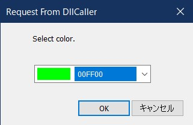

# DLLのダイアログ表示メソッドをVBAから呼び出し、ダイアログを表示させる
目次 Contents
<!-- TOC -->

- [DLLのダイアログ表示メソッドをVBAから呼び出し、ダイアログを表示させる](#dllのダイアログ表示メソッドをvbaから呼び出しダイアログを表示させる)
  - [概要 Overview](#概要-overview)
  - [詳細 Details](#詳細-details)
  - [呼び出し例](#呼び出し例)
    - [C++](#c)
    - [VBA](#vba)
  - [開発環境 Development Environment](#開発環境-development-environment)
  - [ライセンス License](#ライセンス-license)
  - [実行サンプル Sample Image](#実行サンプル-sample-image)
  - [Link](#link)
  - [Z1000R](#z1000r)

<!-- /TOC -->
&nbsp;
## 概要 Overview  
DLL内のリソースに埋め込まれたダイアログを表示するメソッドを用意し、外部から呼び出して表示する。  
また、ダイアログの復帰値を、DLLのメソッド呼び出し元に返す。  
&nbsp;
## 詳細 Details
以前、[【C++】色を選択できるコンボボックス（ドロップダウンリスト）を作ってみた（MFC 未使用）](https://z1000s.hatenablog.com/entry/2021/01/28/233951)で、作成したダイアログを、DLL内に移植し、VBAから呼び出せるようにしたものです。    
&nbsp;
## 呼び出し例
### C++
DllCaller ソースを参照して下さい。  
&nbsp;
### VBA
宣言部 (DLLが 64bit専用で作ったので、32bit用の宣言はありません。)
~~~vb
Private Declare PtrSafe Function showColorComboDialog Lib "ColorDialogDLL.dll" _
   (ByVal vTitle As Variant, _
    ByVal vMessage As Variant, _
    ByRef lColorList() As Long, _
    ByVal lDefaultIndex As Long) As Long
~~~
実行部  
色データは、Long の配列で渡して下さい。  
DLL側では、[COLORREF](https://docs.microsoft.com/en-us/windows/win32/gdi/colorref) (DWORD)の配列として受け取るので、最下位Byteが、R（赤）となります。  
~~~vb
Sub showColorDialog()

    Dim vTitle  As Variant
    Dim vMessage    As Variant
    Dim lColorList() As Long
    Dim lColor      As Long
    Dim i           As Long

    vTitle = "Request From VBA"
    vMessage = "色を選んで下さい。"

    Call setColor1(lColorList)
    lColor = showColorComboDialog(vTitle, vMessage, lColorList, 8)
    Debug.Print Right$("00000" & Hex(lColor), 6)

End Sub

Sub setColor1(ByRef lArry() As Long)

    ReDim lArry(15)

    lArry(0) = &HFFFFFF
    lArry(1) = &HC0C0C0
    lArry(2) = &H808080
    lArry(3) = &H0&
    lArry(4) = &HFF&
    lArry(5) = &H80&
    lArry(6) = &HFFFF&
    lArry(7) = &H8080&
    lArry(8) = &HFF00&
    lArry(9) = &H8000&
    lArry(10) = &HFFFF00
    lArry(11) = &H808000
    lArry(12) = &HFF0000
    lArry(13) = &H800000
    lArry(14) = &HFF00FF
    lArry(15) = &H800080

End Sub
~~~
&nbsp;
## 開発環境 Development Environment
- Windows 10 Home 64bit  
- Visual Studio 2022  
- Visual C++  
- Microsoftr 365 Solo 64bit  
&nbsp;
## ライセンス License
- MIT License  
&nbsp;
## 実行サンプル Sample Image
  
  
VBAでの実行例  
  
&nbsp;
## Link
[【C++】色を選択できるコンボボックス（ドロップダウンリスト）を作ってみた（MFC 未使用）](https://z1000s.hatenablog.com/entry/2021/01/28/233951)
&nbsp;
## Z1000R
Twitter : @Z1000R_LR